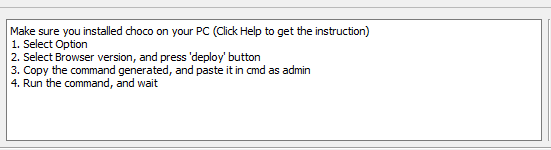

# Browser Deployment Tool - BDT

A neat (QT-Python) GUI software which _help_action you install certain version of browser on Windows Machine.

## Background 

Internet users have wider choice of browsers when it comes to surfing the net. It is our responsibility as designers and developers to ensure that websites we’ve created are compatible for most of the commonly used browsers these days.

That leads to a simple yet critical question – what browsers are our visitors using? According to w3school, commonly used browsers are Internet Explorer 7 & 8 and Firefox with Safari and Google Chrome gradually picking up. But the figures might vary from site to site, depending on its niche. It’s best to get the demographics from your site metrics, Google Analytics for instance.

Once you’ve identified common browsers your visitors use, then it’s time to make sure website displays the same in these browsers. It’s almost impossible to install all different browsers in one machine.
--- Dainis (https://www.hongkiat.com/blog/complete-guide-to-cross-browser-compatibility-check/) 

There are some tools and webservice out there, but they are mostly not free. 

Here is a free solution ! It could be used to deploy different browsers or different versions of browsers to _help_action programmers and testers to check compatibility of Website and Webs.

## How it works

Please check this video: 

[](https://www.youtube.com/watch?v=TU2ydmCo21c&feature=youtu.be)


### **Main UI**


### Upper Sections 

#### Option Section


**Enhancement** - - A ratio box. (It will be enhance or remove in future version)

**Degration** - A ratio box. (It will be enhance or remove in future version)

**Keep Update** - A ratio box which allow user to install or update the latest version of software

**Custom** - A ratio box which allow user to select certain version of software. 

#### Text Area Section



**Text Area** - A Text Area which shows the installation command, _help_action, and handle interaction which users

#### User Actions Section


**Deploy** - A button which generate the installation command 

`Currently, It only generate the command which _help_action user to install softwares `

**Check for Updates** - A button which updates browsers version

`Currently, it will cause a bug due to the web scrawler is not working `

**Help** - A button which shows users how to use

`Working fine`

### Middle Section 
Four Browsers Version lists in ratio box 

### Footer Section
Basic Information about myself

## How to develop

You will need Python3 and pip. 
- Python3 
- pip

`pip install -r requirements.txt`  


## Features

Version 0.30

- [x] Integrate GUI with QT
- [x] Support IE Browsers 
- [x] Support Chrome Browsers
- [x] Support Firefox Browsers
- [x] Support Opera Browsers

**> Current Version 0.40**

- [ ] Fix bug web spider issues - The website was been updated
- [ ] Fix exporting issues - Fail to Export Executable (missing lib)
- [ ] Organizing files and folders
- [ ] Support Multi-Threads to Solve the waiting time when fetching version list
- [ ] Remote Installation Support

TODO Version 0.50

- [ ] Support Multible browsers rather than IE, Chrome, Friefox and Opera 
- [ ] Enable Checking the System has chocolaty installed
- [ ] Support Multiple Application rather than browsers deployment

TODO Version 0.60

- [ ] Support different  languages

TODO Version 0.60

- [ ] Support Brew on Mac

TODO Version 0.70

- [ ] Support pip apt etc

TODO Version 0.70

- [ ] Support Github and Sourceforge

TODO Version Enterprise 1.0

- [ ] Bulk Management 
- [ ] Remote Control  
- [ ] Environment SetUp for different Programming Language
- [ ] HostFile Management

## Current Bugs

Bug 1 -  web spider issues 

Reason : The website was been updated
Log: 
```
Traceback (most recent call last):
  File "C:/Users/user/Downloads/deployTool/mainwindow.py", line 458, in <lambda>
    self.Refresh.clicked.connect(lambda: self._refresh_action())
  File "C:/Users/user/Downloads/deployTool/mainwindow.py", line 511, in _refresh_action
    xhr.get_chrome()
  File "C:\Users\user\Downloads\deployTool\GetBroswers.py", line 53, in get_chrome
    current = mydivs[0].find('span').text
AttributeError: 'NoneType' object has no attribute 'text'
```
Bug 2  exporting issues 

Reason: Fail to Export Executable (missing lib)
Log: 

```
213 INFO: PyInstaller: 3.4
213 INFO: Python: 3.6.2
214 INFO: Platform: Windows-10-10.0.17763-SP0
216 INFO: wrote C:\Users\user\Downloads\deployTool\mainwindow.spec
242 INFO: UPX is not available.
245 INFO: Extending PYTHONPATH with paths
['C:\\Users\\user\\Downloads\\deployTool',
 'C:\\Users\\user\\Downloads\\deployTool']
245 INFO: checking Analysis
253 INFO: Building because C:\Users\user\Downloads\deployTool\mainwindow.py changed
253 INFO: Initializing module dependency graph...
261 INFO: Initializing module graph hooks...
265 INFO: Analyzing base_library.zip ...
6128 INFO: running Analysis Analysis-00.toc
6133 INFO: Adding Microsoft.Windows.Common-Controls to dependent assemblies of final executable
  required by C:\Users\user\AppData\Local\Programs\Python\Python36-32\python.exe
7324 WARNING: lib not found: api-ms-win-crt-conio-l1-1-0.dll dependency of C:\Users\user\AppData\Local\Programs\Python\Python36-32\python36.dll
8286 WARNING: lib not found: api-ms-win-crt-process-l1-1-0.dll dependency of C:\Users\user\AppData\Local\Programs\Python\Python36-32\python36.dll
9266 INFO: Caching module hooks...
9275 INFO: Analyzing C:\Users\user\Downloads\deployTool\mainwindow.py
9788 INFO: Processing pre-safe import module hook   urllib3.packages.six.moves
12933 INFO: Loading module hooks...
12933 INFO: Loading module hook "hook-certifi.py"...
12941 INFO: Loading module hook "hook-encodings.py"...
13210 INFO: Loading module hook "hook-lxml.etree.py"...
13212 INFO: Loading module hook "hook-pydoc.py"...
13213 INFO: Loading module hook "hook-PyQt5.py"...
13638 WARNING: Hidden import "sip" not found!
13639 INFO: Loading module hook "hook-PyQt5.QtCore.py"...
13917 INFO: Loading module hook "hook-PyQt5.QtGui.py"...
14322 INFO: Loading module hook "hook-PyQt5.QtWidgets.py"...
15132 INFO: Loading module hook "hook-xml.py"...
15346 INFO: Looking for ctypes DLLs
15346 INFO: Analyzing run-time hooks ...
15351 INFO: Including run-time hook 'pyi_rth_qt5.py'
15364 INFO: Looking for dynamic libraries
17351 WARNING: lib not found: api-ms-win-crt-conio-l1-1-0.dll dependency of C:\Users\user\AppData\Local\Programs\Python\Python36-32\DLLs\_ssl.pyd
18388 WARNING: lib not found: api-ms-win-crt-conio-l1-1-0.dll dependency of C:\Users\user\AppData\Local\Programs\Python\Python36-32\DLLs\_hashlib.pyd
19560 INFO: Looking for eggs
19560 INFO: Using Python library C:\Users\user\AppData\Local\Programs\Python\Python36-32\python36.dll
19560 INFO: Found binding redirects: 
[]
19568 INFO: Warnings written to C:\Users\user\Downloads\deployTool\build\mainwindow\warn-mainwindow.txt
19668 INFO: Graph cross-reference written to C:\Users\user\Downloads\deployTool\build\mainwindow\xref-mainwindow.html
19696 INFO: checking PYZ
19698 INFO: Building because toc changed
19700 INFO: Building PYZ (ZlibArchive) C:\Users\user\Downloads\deployTool\build\mainwindow\PYZ-00.pyz
20775 INFO: Building PYZ (ZlibArchive) C:\Users\user\Downloads\deployTool\build\mainwindow\PYZ-00.pyz completed successfully.
20804 INFO: checking PKG
20806 INFO: Building because C:\Users\user\Downloads\deployTool\build\mainwindow\PYZ-00.pyz changed
20806 INFO: Building PKG (CArchive) PKG-00.pkg
20852 INFO: Building PKG (CArchive) PKG-00.pkg completed successfully.
20854 INFO: Bootloader C:\Users\user\AppData\Local\Programs\Python\Python36-32\lib\site-packages\PyInstaller\bootloader\Windows-32bit\runw.exe
20854 INFO: checking EXE
20854 INFO: Building EXE because EXE-00.toc is non existent
20854 INFO: Building EXE from EXE-00.toc
20859 INFO: SRCPATH [('logo.ico', None)]
20859 INFO: Updating icons from ['logo.ico'] to C:\Users\user\AppData\Local\Temp\tmpb3vm6gh7
Traceback (most recent call last):
  File "C:/Users/user/Downloads/deployTool/pyinstall.py", line 6, in <module>
    run(opts)
  File "C:\Users\user\AppData\Local\Programs\Python\Python36-32\lib\site-packages\PyInstaller\__main__.py", line 111, in run
    run_build(pyi_config, spec_file, **vars(args))
  File "C:\Users\user\AppData\Local\Programs\Python\Python36-32\lib\site-packages\PyInstaller\__main__.py", line 63, in run_build
    PyInstaller.building.build_main.main(pyi_config, spec_file, **kwargs)
  File "C:\Users\user\AppData\Local\Programs\Python\Python36-32\lib\site-packages\PyInstaller\building\build_main.py", line 838, in main
    build(specfile, kw.get('distpath'), kw.get('workpath'), kw.get('clean_build'))
  File "C:\Users\user\AppData\Local\Programs\Python\Python36-32\lib\site-packages\PyInstaller\building\build_main.py", line 784, in build
    exec(text, spec_namespace)
  File "<string>", line 29, in <module>
  File "C:\Users\user\AppData\Local\Programs\Python\Python36-32\lib\site-packages\PyInstaller\building\api.py", line 433, in __init__
    self.__postinit__()
  File "C:\Users\user\AppData\Local\Programs\Python\Python36-32\lib\site-packages\PyInstaller\building\datastruct.py", line 158, in __postinit__
    self.assemble()
  File "C:\Users\user\AppData\Local\Programs\Python\Python36-32\lib\site-packages\PyInstaller\building\api.py", line 522, in assemble
    icon.CopyIcons(tmpnm, self.icon)
  File "C:\Users\user\AppData\Local\Programs\Python\Python36-32\lib\site-packages\PyInstaller\utils\win32\icon.py", line 177, in CopyIcons
    return CopyIcons_FromIco(dstpath, [srcpath])
  File "C:\Users\user\AppData\Local\Programs\Python\Python36-32\lib\site-packages\PyInstaller\utils\win32\icon.py", line 134, in CopyIcons_FromIco
    for i, f in enumerate(icons):
  File "C:\Users\user\AppData\Local\Programs\Python\Python36-32\lib\site-packages\PyInstaller\utils\win32\icon.py", line 104, in __init__
    entry.fromfile(file)
  File "C:\Users\user\AppData\Local\Programs\Python\Python36-32\lib\site-packages\PyInstaller\utils\win32\icon.py", line 65, in fromfile
    self._fields_ = list(struct.unpack(self._format_, data))
struct.error: unpack requires a bytes object of length 16
```